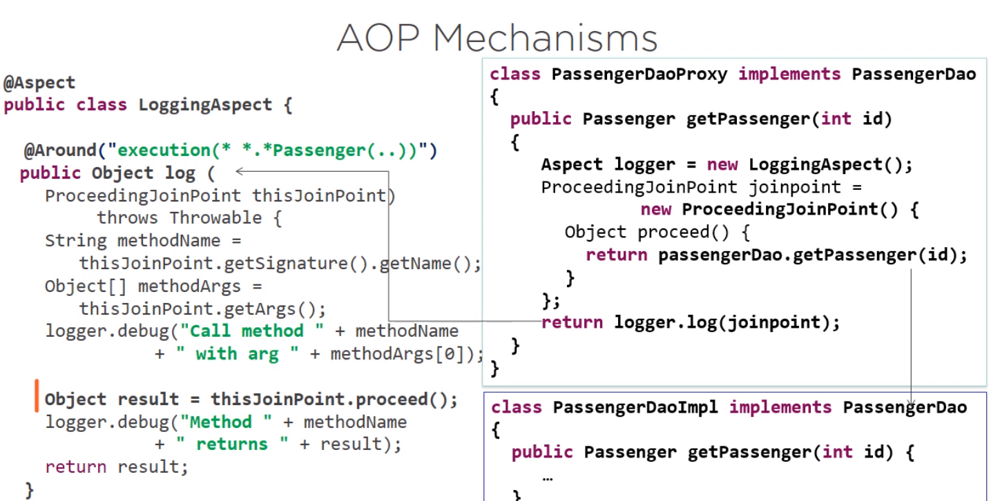
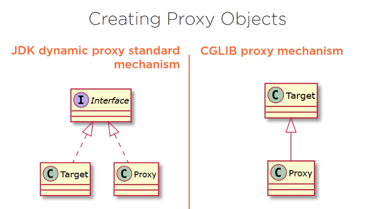

# Spring Aspect Oriented Programming

## What Is Aspect Oriented Programming?
AOP comes to solve a problem with code that is called **code of crosscutting functionallity**, such as logging, validation, user rights checks, caching, exception handling, etc. By moving it from the business code logic in order to avoid the latter being mixed with the others.

The main ideia is to remove and create specialized classes for those crosscutting functionallity, which also can be called **aspects (modularization of a concern)**

1. Do something before the method
2. Call the method
3. Do something after the method

### AOP Key-words
- Aspect: A modularization of a concern that cuts across multiple classes. Transaction management is a good example of a crosscutting concern in enterprise Java applications. In Spring AOP, aspects are implemented by using regular classes (the schema-based approach) or regular classes annotated with the `@Aspect` annotation (the @AspectJ style).

- Join point: A point during the execution of a program, such as the **execution of a method** or the **handling of an exception**. In Spring AOP, a join point always represents a method execution. A JoinPoint represents a point in your application where you can plug-in AOP aspect. You can also say, it is the actual place in the application where an action will be taken using Spring AOP framework. 
	-  	All methods classes contained in a package(s).
    
	-   A particular methods of a class.
	
- Advice: Action taken by an aspect at a particular join point. Different types of advice include “around”, “before” and “after” advice. Many AOP frameworks, including Spring, model an advice as an interceptor and maintain a chain of interceptors around the join point.

- Pointcut: A predicate that matches join points. Advice is associated with a pointcut expression and runs at any join point matched by the pointcut (for example, the execution of a method with a certain name).

- Target object: An object being advised by one or more aspects.	

    
## Types of Advice    
-   **Before** advice: Advice that runs before a join point but that does not have the ability to prevent execution flow proceeding to the join point (unless it throws an exception).

-   **After returning** advice: Advice to be run after a join point completes normally (for example, if a method returns without throwing an exception).
    
-   **After throwing** advice: Advice to be executed if a method exits by throwing an exception.
    
-   **After** (finally) advice: Advice to be executed regardless of the means by which a join point exits (normal or exceptional return).
    
-   **Around** advice: Advice that surrounds a join point such as a method invocation. This is the most powerful kind of advice. Around advice can perform custom behavior before and after the method invocation. It is also responsible for choosing whether to proceed to the join point or to shortcut the advised method execution by returning its own return value or throwing an exception.

### Aspect Example I
```java

@Aspect
public class LoggingAspect {
	private Logger logger = Logger.getLogger(LoggingAspect.class.getName());

	//Because of the setup of the around annotation, this method is going to be executed 
	//around the execution of any method whose name ends with passenger, the method may 
	//belong to any package, may receive any argument and may return anything; 
	@Around("execution(* *.*Passenger(..))")
	public Object log (ProceedingJoinPoint thisJoinPoint) throws Throwable {
                
                String methodName = thisJoinPoint.getSignature().getName();
                Object[] methodArgs = thisJoinPoint.getArgs();
                
                logger.info("Call method " + methodName + " with arg " + methodArgs[0]);
                
                Object result = thisJoinPoint.proceed();
                
                logger.info("Method " + methodName + " returns " + result);
                
                return result;
	}

}
```
### Aspect Example II

```java
@Aspect

// Priority of aspect execution
@Order(1)  
public class LoggingAspect1 {  
  
    private Logger logger = Logger.getLogger(LoggingAspect1.class.getName());  
   
    @Before("execution(public String com.aug.bueno.domain.Flight.getId())")  
    public void loggingAdviceGetId() {  
        logger.info("Flight getId method will be called");  
    }  
  
    @AfterReturning("execution(public * *.print())")  
    public void loggingAdvicePrint() {  
        logger.warning("A print method has been called");  
    }  
  
    @Pointcut("within(com.aug.bueno.domain.Ticket)")  
    public void allTicketMethods() {  

    }  

    //This pointcut indicates ant method that return anything, and is part of the package aug.bueno.domain, 
	//and belongs to any class inside that package, and contains the word 'set' in its method signature, 
	//and receives any parameter 
    @Pointcut("execution(* aug.bueno.domain.*.*set*(..))")  
    public void allSetters() {  
  
    }
  
	// these means that the method will be executed after any method that matches the point cut defined defined by allTicketMethods
    @After("allTicketMethods()")  
    public void loggingAdvice(JoinPoint jointPoint) {  
        logger.info("A ticket method had been called.");  
        logger.info(jointPoint.toString());  
        logger.info(jointPoint.getTarget().toString());  
    }
   
	// The situation to trigger this aspect is defined in the Pointcut 'allsetters'
	@Around("allSetters()")  
	public Object log (ProceedingJoinPoint thisJoinPoint) throws Throwable {  
	    String methodName = thisJoinPoint.getSignature().getName();  
	    Object[] methodArgs = thisJoinPoint.getArgs();  
	    logger.severe("Call method " + methodName + " with arg " + methodArgs[0]);  
	    Object result = thisJoinPoint.proceed();  
	    logger.severe("Method " + methodName + " returns " + result);  
	    return result;  
	}
  
}
```

## AOP - Mechanisms


As shown in the picture, Spring creates a proxy class (`PassengerDaoProxy`), that implements `PassengerDao` and will replace the original `PassengerDaoImpl`. Firstly, the proxy class will create the `LoggingAspect` object (FYI: LoggingAspect is a custom aspect implemented to help log passenger objects), then it creates a `ProceedingJointPoint` as well as defines the implemetation of `ProceedingJointPoint`'s `proceed` method that by it turns will cann the original `PassengerDaoImpl`. Last, it will return the result of `logger.log(joinpoint)`

### How Proxy Objects are Created?


#### JDK Dynamic Proxy Standard Mechanism
If the target class implements an interface, the proxy object implements the same interface in order to be able to replace the original class in the code execution.

#### CGLIB Proxy Mechanism
If the target class does not implement an interface, then the proxy object will extends the target class itself and this way it will be able to play the role of the substituted class.


## 


### Project - Manager of Flights and Passengers
